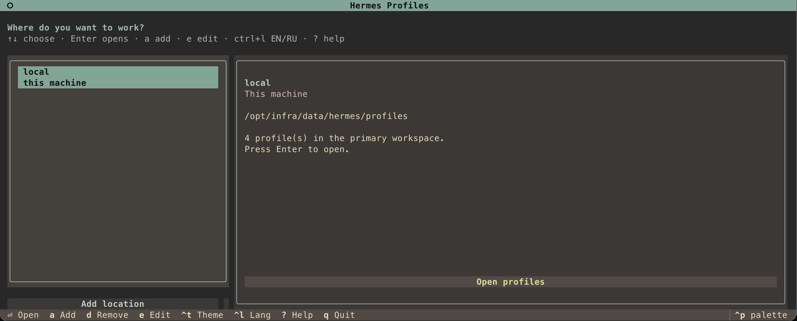

# Hermes Profile CLI

Manage your Hermes agent profiles from a terminal interface or the command line —
on this computer, in other local folders, or on SSH hosts.

Share common settings between agents while keeping each profile’s model,
integrations, environment variables, and authentication bindings separate.



*Choose a location, open its profiles, preview changes, and apply when ready.*

[Quick start](#quick-start) · [Keyboard shortcuts](#keyboard-shortcuts) ·
[Commands](#everyday-commands) · [User guide](docs/guide.md) ·
[Changelog](CHANGELOG.md)

## What can I do with it?

- **Manage multiple agents:** build each profile from reusable YAML and environment fragments.
- **Check before applying:** preview configuration and see pending changes.
- **Preserve edits made by Hermes:** detect drift and save those edits in a runtime overlay.
- **Work locally or over SSH:** switch locations from the same interface.
- **Manage auth and backups:** bind identities and back up profile declarations and fragments.
- **Choose your interface:** TUI with English/Russian and themes, CLI with JSON output, or optional MCP.

This is the **profile manager** (`hermes-profile`). Run your agents with the
separate `hermes` command. Applying a profile writes its configuration; it does
not start or restart agents or manage services.

## Quick start

### 1. Install

You need **Python 3.11+** and **Git**. Remote locations also require system SSH.
On macOS, if your Python is too old, install a newer one with
`brew install python@3.12` and use `python3.12` below.

```bash
git clone https://github.com/RuBAN-GT/hermes-profile-cli.git
cd hermes-profile-cli
python3 -m venv .venv
source .venv/bin/activate
python -m pip install .
hermes-profile --version
```

Activate `.venv` again when opening a new terminal, or run the installed command
by its full path: `<checkout>/.venv/bin/hermes-profile`.
Developer installation and checks are in [CONTRIBUTING.md](CONTRIBUTING.md).

### 2. Choose where to work

```bash
hermes-profile tui
```

On the first run, choose **this computer** or **an SSH host** and follow the
setup prompts. For local use, the defaults are enough to get started:

| Path | Purpose |
| --- | --- |
| `~/.config/hermes-profile/config.yaml` | Manager settings and locations |
| `~/.local/share/hermes-profile/managed/profiles` | Your agents’ profile homes |
| `~/.local/share/hermes-profile/managed/fragments` | Shared YAML and environment files |

Already have profiles elsewhere? Press `e` on the `local` location to set your
existing profiles and fragments paths. Use **Add** for another folder or SSH host.
Operational data stays outside this repository.

### 3. Create and apply a profile

Open a location with `Enter`. Use **New** (`n`) to create a profile.
A new workspace starts empty: creating a profile does not configure an agent
for you. Add the configuration and environment fragments you need, then inspect
**Preflight** (`f`) before **Apply** (`a`).

If you already have a configured profile, reuse its shared settings from the CLI:

```bash
hermes-profile create work --share-from personal
hermes-profile preflight work
hermes-profile apply work
hermes-profile status work
```

Replace `personal` with an existing profile. Shared references are copied;
private secrets are not. Set the new profile’s private environment values before
starting its agent. See [fragment layout and merging](docs/guide.md#how-it-works).

## Keyboard shortcuts

The footer shows actions available on the current screen.

| Key | Action |
| --- | --- |
| `↑` / `↓`, `Enter` | Select and open a location |
| `a` / `e` on the locations screen | Add / edit a location |
| `n` in a workspace | Create a profile |
| `p` / `f` | Preview / preflight changes |
| `a` / `Shift+A` in a workspace | Apply selected / all profiles, with confirmation |
| `u` / `m` | Authentication / more actions, including backups |
| `r` / `Esc` | Refresh / return to locations |
| `Ctrl+L` / `Ctrl+T` | Switch English/Russian / theme |
| `?` or `F1` | Help |
| `q` | Quit |

The running version is displayed in the TUI header and by
`hermes-profile --version`. Theme and language preferences are saved.

## Everyday commands

Prefix each command below with `hermes-profile`.

| Command | What it does |
| --- | --- |
| `list` | List profiles |
| `show NAME` | Show the profile’s fragment references |
| `render NAME` | Preview merged YAML; environment values stay hidden |
| `preflight NAME` | Inspect changes without writing files |
| `apply NAME` | Generate the profile’s `config.yaml` and `.env` |
| `apply-all` | Apply every profile; stop at the first error or drift |
| `status NAME` | Check configuration drift and auth inventory |
| `reconcile NAME` | Preserve runtime additions and changes in an overlay |
| `backup create` | Back up declarations, fragments, and runtime overlays |
| `--host HOST list` | List profiles on a configured SSH host |
| `--format json list` | Return JSON for scripts |

If `apply` reports drift, use `reconcile NAME` to preserve changes made by
Hermes, then apply again. Use `apply NAME --discard-runtime` only when you intend
to replace those changes with the declared fragments. Bulk apply is not atomic:
profiles processed before an error remain applied.

## More help

- [Configuration, fragments, drift, and secrets](docs/guide.md#how-it-works)
- [Authentication identities](docs/guide.md#auth-map-and-identities) and [adapters](docs/guide.md#auth-adapters)
- [Setup backups and restore](docs/guide.md#setup-backups) — excludes sessions, databases, and auth stores
- [SSH setup and remote requirements](docs/guide.md#remote-hosts)
- [MCP integration](docs/guide.md#mcp)
- [Example manager configuration](config.example.yaml)

Run `hermes-profile help` for the built-in guide, or append `--help` to a command.
To use another manager configuration:

```bash
hermes-profile --config /path/to/config.yaml tui
```

## Updating

```bash
hermes-profile self-update
```

The updater checks for local changes and advances the checkout to `origin/main`
only when a fast-forward is possible. Commit or stash local changes first; if
histories have diverged, resolve that manually. It then reinstalls into the
current Python environment. See [CHANGELOG.md](CHANGELOG.md) for release details.
