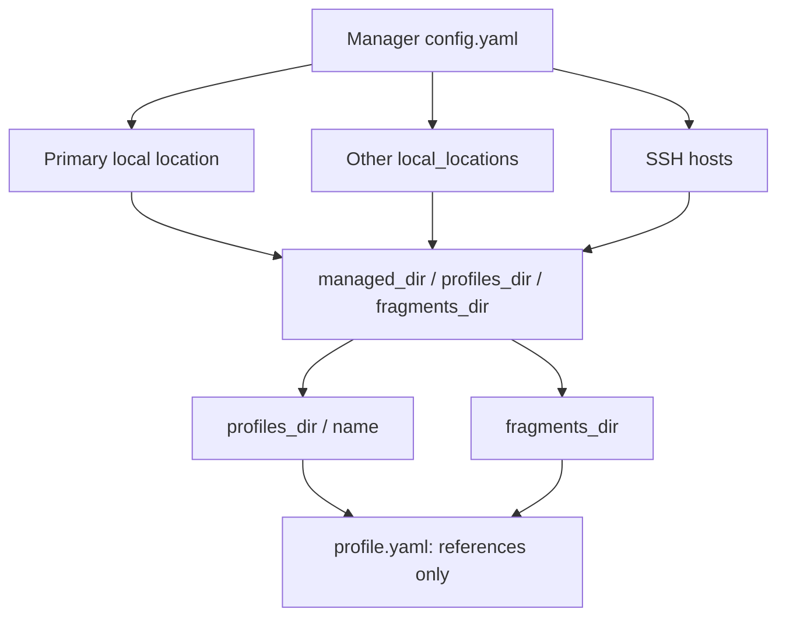
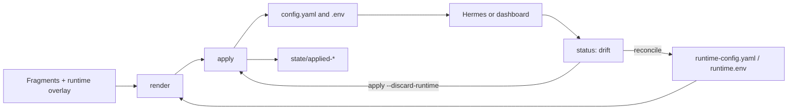

# Hermes Profile CLI

`hermes-profile` materializes isolated Hermes agent homes from shared YAML and
environment fragments. Profile selection and file generation happen **before**

- This is not the `hermes` agent binary: use `hermes-profile` for the remote
  manager CLI.
- The tool does not create, restart, or delete `launchd` services. A controller
  can run `hermes-profile apply <profile>` before operating a profile service.

## Contents

- [What It Does](#what-it-does)
- [Requirements And Installation](#requirements-and-installation)
- [First Run](#first-run)
- [How It Works](#how-it-works)
- [Daily Operations](#daily-operations)
- [Merging, Drift, And Secrets](#merging-drift-and-secrets)
- [Remote Hosts](#remote-hosts)
- [Updates And Help](#updates-and-help)

## What It Does

A profile is a separate Hermes directory containing `config.yaml`, `.env`, and
the state from its last apply. Shared configuration fragments stay in one place,
while `profile.yaml` only refers to them. This is useful when several agents
share a base configuration but need different models, integrations, or secrets.

Fragments and profiles are operational data: this repository neither creates
nor tracks them.

## Requirements And Installation

You need Python 3.11+, `git`, and system `ssh` for remote hosts. If the macOS
`python3` is older than 3.11, install a current Python version:

```bash
brew install python@3.12
```

Install for local use:

```bash
git clone https://github.com/RuBAN-GT/hermes-profile-cli.git
cd hermes-profile-cli
python3 -m venv .venv
.venv/bin/python -m pip install -U pip
.venv/bin/python -m pip install -e '.[dev]'
.venv/bin/hermes-profile --version
```

Optionally put the command on your `PATH`:

```bash
mkdir -p ~/.local/bin
ln -sf "$(pwd)/.venv/bin/hermes-profile" ~/.local/bin/hermes-profile
```

## First Run

The primary path is interactive setup:

```bash
hermes-profile tui
```

First choose this computer or an SSH host, then set the manager, profiles, and
fragments paths. In the TUI, `?` or `F1` opens concise help; the selected theme
is saved in the manager configuration.

For non-interactive use, run `init`:

```bash
hermes-profile init --managed-dir /srv/hermes/managed
hermes-profile init --managed-dir /srv/hermes/managed \
  --profiles-dir /srv/hermes/homes \
  --fragments-dir /srv/hermes/fragments
```

By default, the manager configuration is
`~/.config/hermes-profile/config.yaml`, and `managed_dir` is
`~/.local/share/hermes-profile/managed`. You can also copy
`config.example.yaml` outside this repository and pass it with `--config` or
`HERMES_PROFILE_CONFIG`. Paths in the example are examples only.

## How It Works

The manager configuration lists work locations: the primary local location,
other local folders, and SSH hosts. Each location has three roots:
`managed_dir`, `profiles_dir`, and `fragments_dir`.



`profile.yaml` contains paths relative to `fragments_dir`:

```yaml
config:
  - config/base.yaml
  - config/telegram.yaml
env:
  - env/common.env
  - env/tyrion.private.env
```

After creation and application, a profile looks like this:

```text
<profiles_dir>/<profile>/
  profile.yaml
  config.yaml
  .env
  runtime-config.yaml
  runtime.env
  auth.json                     # Hermes-owned; the manager never writes it
  state/
    applied-config.yaml
    applied.env
    auth-inventory.sha256
```

Profile names may contain lowercase ASCII letters, digits, and hyphens, must
start with a letter or digit, and have a maximum length of 63 characters.

## Daily Operations

| Command | Use it to |
| --- | --- |
| `list` | list known profiles |
| `create NAME` | create an empty profile and its `state/` directory |
| `show NAME` | inspect fragment references |
| `render NAME` | view the resulting YAML; environment values stay hidden |
| `status NAME` | check file drift and authentication inventory |
| `apply NAME` | render fragments into `config.yaml` and `.env` |
| `reconcile NAME` | preserve Hermes changes in the runtime overlay |
| `delete NAME --confirm` | delete a profile |

A typical workflow:

```bash
hermes-profile create tyrion
hermes-profile update tyrion --add-config config/base.yaml --add-env env/common.env
hermes-profile render tyrion
hermes-profile apply tyrion
hermes-profile status tyrion
```

For scripts, add the global `--format json`. `update` only adds fragment
references; prepare the fragments themselves first.

## Merging, Drift, And Secrets

YAML maps merge recursively. Lists and scalar values in a later fragment replace
earlier values. Environment fragments allow only comments, blank lines, and
`NAME=value` assignments; they are never executed as shell code.



`apply` refuses to overwrite `config.yaml` or `.env` when they differ from the
last snapshot. This protects changes made through Hermes, a dashboard, or a
plugin. Choose one path:

```bash
# Preserve added and changed runtime values in the overlay.
hermes-profile reconcile tyrion
hermes-profile apply tyrion

# Discard the runtime overlay and build from declared fragments only.
hermes-profile apply tyrion --discard-runtime
```

`reconcile` does not support deleting keys yet.

Hermes owns `auth.json`. The manager never copies, displays, or edits it.
`status` tracks only an inventory digest: provider, credential ID,
authentication type, and source. Token refreshes do not cause drift; adding,
removing, or changing a credential does. `reconcile` only acknowledges the
current inventory.

Private environment files and snapshots are written with mode `0600`; profile
and `state/` directories use mode `0700`.

## Remote Hosts

Add an SSH host through `hermes-profile tui` or the manager configuration. Use
your existing SSH agent and keys; passwords are not stored. The TUI provides
**Save host**, **Init dirs**, and **Clone + install**.

```bash
hermes-profile ssh init gateway-a
hermes-profile ssh install gateway-a
hermes-profile --host gateway-a list
hermes-profile --host gateway-a apply tyrion
```

`ssh init` creates only directories and a secret-free manager configuration if
one does not yet exist. It does not copy profiles, `.env` files, credentials, or
create services. `ssh install` first runs `init`, then clones this repository
and installs the CLI on the remote machine:

```text
~/.local/share/hermes-profile/src
~/.local/share/hermes-profile/venv
~/.local/share/hermes-profile/venv/bin/hermes-profile
```

The remote host also needs `git` and Python 3.11+. Do not set `remote_binary`
to `hermes`: it is the agent, not the profile manager.

| Action | Without the remote CLI | With `hermes-profile` on the host |
| --- | --- | --- |
| `list`, `status`, Preview | SSH file reads | CLI JSON |
| `create`, `apply`, `reconcile` | no | yes |
| `ssh doctor` | no | yes |

Without the remote CLI, Preview shows existing `config.yaml` and the number of
variables in `.env`; it does not render fragments. Authentication inventory
checks are also limited to file presence in this mode.

## Updates And Help

Update a CLI installed from git:

```bash
hermes-profile self-update
```

The command fetches `main`, runs `reset --hard`, and reinstalls the package into
the current Python. Do not run it from a checkout with uncommitted changes.

Full help is available through `hermes-profile help`, or `?` / `F1` in the TUI.
Contribution requirements and local checks are in
[CONTRIBUTING.md](CONTRIBUTING.md).
