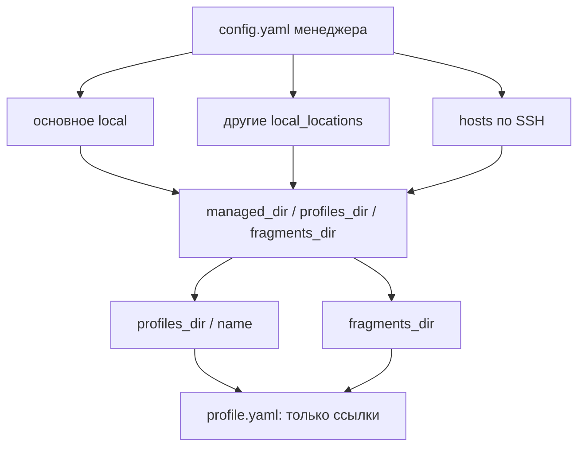
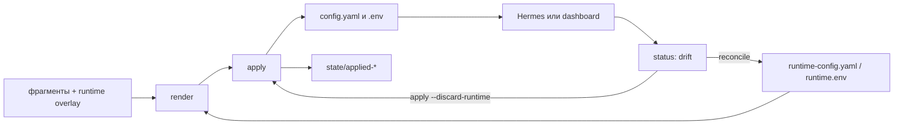

# Hermes Profile CLI

`hermes-profile` собирает изолированные домашние каталоги агента Hermes из
общих YAML- и env-фрагментов. Выбор профиля и запись файлов происходят **до**
запуска gateway. Инструмент работает локально и по SSH.

- Это не бинарник агента `hermes`: для удалённого менеджера используйте
  `hermes-profile`.
- Инструмент не создаёт, не перезапускает и не удаляет сервисы `launchd`.
  Контроллер может вызвать `hermes-profile apply <profile>` перед работой со
  службой профиля.

## Содержание

- [Что это](#что-это)
- [Требования и установка](#требования-и-установка)
- [Первый запуск](#первый-запуск)
- [Как устроено](#как-устроено)
- [Повседневная работа](#повседневная-работа)
- [Слияние, drift и секреты](#слияние-drift-и-секреты)
- [Удалённые хосты](#удалённые-хосты)
- [Обновление и справка](#обновление-и-справка)

## Что это

Профиль - это отдельная директория Hermes с `config.yaml`, `.env` и состоянием
последнего применения. Общие фрагменты конфигурации остаются в одном месте, а
`profile.yaml` лишь ссылается на них. Это удобно, когда несколько агентов
делят базовую конфигурацию, но имеют разные модели, интеграции или секреты.

Фрагменты и сами профили - операционные данные: этот репозиторий их не создаёт
и не хранит.

## Требования и установка

Нужны Python 3.11+, `git` и, для удалённых хостов, системный `ssh`. На macOS,
где `python3` старее 3.11, установите современный Python:

```bash
brew install python@3.12
```

Установка для локальной работы:

```bash
git clone https://github.com/RuBAN-GT/hermes-profile-cli.git
cd hermes-profile-cli
python3 -m venv .venv
.venv/bin/python -m pip install -U pip
.venv/bin/python -m pip install -e '.[dev]'
.venv/bin/hermes-profile --version
```

При желании сделайте команду доступной из `PATH`:

```bash
mkdir -p ~/.local/bin
ln -sf "$(pwd)/.venv/bin/hermes-profile" ~/.local/bin/hermes-profile
```

## Первый запуск

Основной путь - интерактивная настройка:

```bash
hermes-profile tui
```

Сначала выберите этот компьютер или SSH-хост. Затем укажите пути менеджера,
профилей и фрагментов. В TUI `?` или `F1` открывают краткую справку; выбранная
тема сохраняется в конфигурации менеджера.

Для сценариев без TUI используйте `init`:

```bash
hermes-profile init --managed-dir /srv/hermes/managed
hermes-profile init --managed-dir /srv/hermes/managed \
  --profiles-dir /srv/hermes/homes \
  --fragments-dir /srv/hermes/fragments
```

По умолчанию конфигурация менеджера хранится в
`~/.config/hermes-profile/config.yaml`, а `managed_dir` - в
`~/.local/share/hermes-profile/managed`. Также можно скопировать
`config.example.yaml` вне репозитория и передать его через `--config` или
`HERMES_PROFILE_CONFIG`. Пути в примере - только примеры.

## Как устроено

Конфигурация менеджера перечисляет места работы: основное локальное, другие
локальные папки и SSH-хосты. У каждого места есть три корня:
`managed_dir`, `profiles_dir` и `fragments_dir`.



`profile.yaml` хранит относительные ссылки внутри `fragments_dir`:

```yaml
config:
  - config/base.yaml
  - config/telegram.yaml
env:
  - env/common.env
  - env/tyrion.private.env
```

После создания и применения профиль выглядит так:

```text
<profiles_dir>/<profile>/
  profile.yaml
  config.yaml
  .env
  runtime-config.yaml
  runtime.env
  auth.json                     # принадлежит Hermes, менеджер его не пишет
  state/
    applied-config.yaml
    applied.env
    auth-inventory.sha256
```

Имя профиля может содержать только строчные латинские буквы, цифры и дефисы,
начинаясь с буквы или цифры; максимальная длина - 63 символа.

## Повседневная работа

| Команда | Когда использовать |
| --- | --- |
| `list` | посмотреть известные профили |
| `create NAME` | создать пустой профиль и его `state/` |
| `show NAME` | проверить ссылки на фрагменты |
| `render NAME` | просмотреть итоговый YAML; значения env не выводятся |
| `status NAME` | проверить изменения файлов и inventory авторизации |
| `apply NAME` | собрать фрагменты и записать `config.yaml` и `.env` |
| `reconcile NAME` | сохранить изменения Hermes в runtime overlay |
| `delete NAME --confirm` | удалить профиль |

Обычный рабочий цикл:

```bash
hermes-profile create tyrion
hermes-profile update tyrion --add-config config/base.yaml --add-env env/common.env
hermes-profile render tyrion
hermes-profile apply tyrion
hermes-profile status tyrion
```

Для скриптов добавьте глобальный `--format json`. Команда `update` только
добавляет ссылки на фрагменты; сами фрагменты подготовьте заранее.

## Слияние, drift и секреты

YAML-карты сливаются рекурсивно. Списки и простые значения из более позднего
фрагмента заменяют предыдущие. Env-фрагменты допускают только комментарии,
пустые строки и `NAME=value`; они никогда не выполняются как shell-код.



`apply` не перезапишет `config.yaml` или `.env`, если они отличаются от
последнего снимка. Это защищает изменения, сделанные через Hermes, dashboard
или плагин. Выберите один из путей:

```bash
# Сохранить добавленные и изменённые runtime-значения в overlay.
hermes-profile reconcile tyrion
hermes-profile apply tyrion

# Отбросить runtime overlay и собрать только объявленные фрагменты.
hermes-profile apply tyrion --discard-runtime
```

Удаление ключей при `reconcile` пока не поддерживается.

`auth.json` принадлежит Hermes. Менеджер не копирует, не показывает и не
изменяет его. `status` отслеживает только хеш inventory: provider, ID
учётной записи, тип авторизации и источник. Обновление токена не создаёт drift;
добавление, удаление или смена учётной записи создаёт. `reconcile` лишь
подтверждает текущее inventory.

Приватные env-файлы и снимки записываются с правами `0600`; каталоги профиля и
`state/` - с `0700`.

## Удалённые хосты

Сначала добавьте SSH-хост через `hermes-profile tui` или конфигурацию менеджера.
Используйте существующий SSH agent и ключи: пароли не сохраняются. Для TUI
доступны кнопки **Save host**, **Init dirs** и **Clone + install**.

```bash
hermes-profile ssh init gateway-a
hermes-profile ssh install gateway-a
hermes-profile --host gateway-a list
hermes-profile --host gateway-a apply tyrion
```

`ssh init` создаёт только каталоги и secret-free конфигурацию менеджера, если
её ещё нет. Он не копирует профили, `.env`, credentials и не создаёт сервисы.
`ssh install` сначала выполняет `init`, затем клонирует этот репозиторий и
устанавливает CLI на удалённой машине:

```text
~/.local/share/hermes-profile/src
~/.local/share/hermes-profile/venv
~/.local/share/hermes-profile/venv/bin/hermes-profile
```

Удалённому хосту также нужны `git` и Python 3.11+. Не указывайте `hermes` как
`remote_binary`: это агент, а не менеджер профилей.

| Действие | Без remote CLI | С `hermes-profile` на хосте |
| --- | --- | --- |
| `list`, `status`, Preview | чтение файлов по SSH | CLI JSON |
| `create`, `apply`, `reconcile` | нет | да |
| `ssh doctor` | нет | да |

Preview без удалённого CLI показывает уже записанные `config.yaml` и число
переменных `.env`; он не собирает фрагменты. Проверка auth inventory в таком
режиме также ограничена наличием файлов.

## Обновление и справка

Обновить установленный из git CLI:

```bash
hermes-profile self-update
```

Команда получает `main`, делает `reset --hard` и переустанавливает пакет в
текущий Python. Не запускайте её из checkout с незакоммиченными изменениями.

Полная справка доступна через `hermes-profile help`, а в TUI - через `?` или
`F1`. Требования к вкладу и локальные проверки описаны в
[CONTRIBUTING.md](CONTRIBUTING.md).
