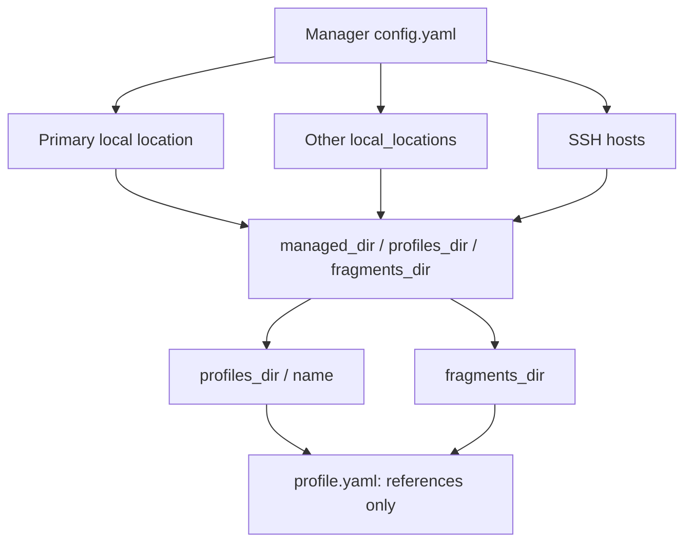
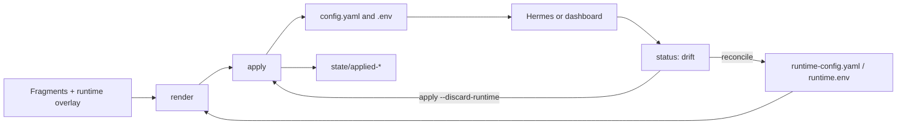

# User guide

[← Quick start](../README.md)

## How It Works

The manager configuration lists work locations: the primary local location,
other local folders, and SSH hosts. Each location has three roots:
`managed_dir`, `profiles_dir`, and `fragments_dir`.



`profile.yaml` contains paths relative to `fragments_dir`:

```yaml
config:
  - config/common.yaml
  - config/host.yaml
  - config/capabilities/browser.yaml
  - config/profiles/ned.yaml
env:
  - env/common.env
  - env/terminal.env
  - env/profiles/ned.private.env
auth: ned
```

`config/common.yaml` and `config/host.yaml` are shared. Capability fragments are
optional mixins. `config/profiles/<name>.yaml` is the profile itself: policy plus
identity (pet, memory db path, docker volumes). `create --share-from` copies
shared refs and retargets that profile file without copying secrets.

```bash
hermes-profile create ned --share-from gogol
```

After creation and application, a profile looks like this:

```text
<profiles_dir>/<profile>/
  profile.yaml
  config.yaml
  .env
  runtime-config.yaml
  runtime.env
  auth.json                     # Hermes-owned live store; bound from an identity
  state/
    applied-config.yaml
    applied.env
    auth-inventory.sha256
```

Profile names may contain lowercase ASCII letters, digits, and hyphens, must
start with a letter or digit, and have a maximum length of 63 characters.

## Daily Operations

### Fragment Interpolation

YAML string values and env fragment values support `${VAR}` using environment
variable names (`[A-Za-z_][A-Za-z0-9_]*`). This is not shell evaluation: quotes in
env values remain literal, and `$VAR`, command substitution, and shell default
expressions are not interpreted. YAML is parsed before expansion, so inserted
text stays a string, not YAML syntax. Keys, scalar types, list order, and mapping
order are unchanged by expansion. Existing merge and output sorting rules still
apply. Fragment references in `profile.yaml` are not expanded.

Env fragments are assembled first, in declaration order. Each assignment can
reference the process environment or earlier resolved assignments, including
earlier lines in the same fragment. Later assignments win; `TOKEN=${TOKEN}` reads
the process or previous assignment, not itself. Forward references to later
assignments are not supported. The process environment is snapshotted once per
render and never modified.

When absent from the process environment, these lookup-only defaults are provided:

| Variable | Fallback |
| --- | --- |
| `HERMES_PROFILE` | Profile name |
| `HERMES_PROFILE_DIR` | `profiles_dir / name` |
| `HERMES_PROFILES_DIR` | Configured `profiles_dir` |
| `HERMES_FRAGMENTS_DIR` | Configured `fragments_dir` |
| `HERMES_MANAGED_DIR` | Configured `managed_dir` |

Explicit empty process values are preserved. Env assignments can override these
defaults. Neither defaults nor other process variables are automatically emitted
into `.env`; a fragment must declare an assignment. `HERMES_HOME` has no automatic
fallback. Declare it explicitly if required, for example:

```text
HERMES_HOME=${HERMES_PROFILE_DIR}
TOKEN=${TOKEN}
ENDPOINT=https://example.invalid/${HERMES_PROFILE}
```

YAML fragments use the final assembled env, including literal `runtime.env`
overrides. `runtime-config.yaml` is then merged literally. Neither runtime file
is expanded, including escape sequences. Fragment-only rendering
(`include_runtime=False`, also used by `apply --discard-runtime`) ignores both.

Expansion is single-pass: inserted `${OTHER}` text is never rescanned. Write
`$${VAR}` in a fragment to produce literal `${VAR}`, even if VAR is missing.
**Migration:** existing literal `${VAR}` strings in fragments must now be escaped
as `$${VAR}` to retain their old behavior. Do not escape runtime overlays.
Missing-variable errors name only the missing variable. Expanded env assignments
containing CR, LF, or NUL are rejected without displaying their values.

### Preview Safety

CLI, operations, MCP, and TUI previews redact YAML values substituted from process
or assembled env variables. Computed fallback names/paths remain visible unless
overridden. Environment values remain hidden. Preflight redacts both the old and
new sides of both config diffs. Changed redacted values use `<redacted: changed>`
on the proposed side; equal values produce no diff. Lists containing substitutions
are redacted as a whole to protect
removed or reordered entries. Unrelated configuration is not hidden.

Apply writes actual values, with private file permissions, and records paths only
in `state/interpolation.yaml` before writing config. Historical paths are retained
to protect removed fields and literal runtime overrides on subsequent previews.
Keep this metadata with the profile; deleting it loses historical protection.
Live-file fallback previews also honor it. SSH CLI rendering requires an updated
remote CLI; the environment used for interpolation is that remote process's env.

This is provenance-based redaction, not a general secret detector. Hardcoded YAML
secrets, secrets moved to unrelated paths outside the manager, and historical
substitutions without retained metadata cannot be reliably identified. Review
those files privately rather than assuming every YAML preview is sanitized.

| Command | Use it to |
| --- | --- |
| `list` | list known profiles |
| `create NAME` | create a profile; `--share-from` copies shared fragment refs |
| `show NAME` | inspect fragment references |
| `render NAME` | view the resulting YAML; environment values stay hidden |
| `preflight NAME` | show effective vs file diffs before apply |
| `status NAME` | check file drift and authentication inventory |
| `apply NAME` | render fragments into `config.yaml` and `.env` |
| `apply-all` | render every profile; stops at the first profile with drift or an error |
| `reconcile NAME` | preserve Hermes changes in the runtime overlay |
| `auth shared-status` | inspect the Hermes root auth fallback |
| `auth map-status` | inspect identity bindings without exposing secrets |
| `auth bind NAME` | attach mapped identity stores to a profile |
| `auth sources --from ADAPTER` | list OpenCode, Codex, or Hermes credentials |
| `auth import --from ADAPTER --identity NAME` | import into an identity or shared store |
| `auth export --to ADAPTER --identity NAME` | export an identity through an adapter |
| `auth push --host HOST --identity NAME` | copy an identity or shared slice over SSH |
| `auth sync --from NAME --provider ID` | copy selected providers into shared auth |
| `backup create` | snapshot fragments and profile declarations |
| `backup list` | list setup backups |
| `backup restore NAME --confirm` | restore setup files from a snapshot |
| `delete NAME --confirm` | delete a profile |

A typical workflow:

```bash
hermes-profile create tyrion --share-from gogol
hermes-profile update tyrion --add-config config/capabilities/web.yaml
hermes-profile render tyrion
hermes-profile preflight tyrion
hermes-profile apply tyrion
hermes-profile status tyrion
```

For scripts, add the global `--format json`. `update --add-*` appends fragment
references; `--set-config` / `--set-env` replace the list. Prepare the fragments
themselves first.

## Merging, Drift, And Secrets

YAML maps merge recursively. Lists and scalar values in a later fragment replace
earlier values. Environment fragments allow only comments, blank lines, and
`NAME=value` assignments; they are never executed as shell code.



`apply` refuses to overwrite `config.yaml` or `.env` when they differ from the
last snapshot. This protects changes made through Hermes, a dashboard, or a
plugin. Choose one path:

```bash
# Preserve added and changed runtime values in the overlay.
hermes-profile reconcile tyrion
hermes-profile apply tyrion

# Discard the runtime overlay and build from declared fragments only.
hermes-profile apply tyrion --discard-runtime
```

`reconcile` does not support deleting keys yet.

`apply` writes `config.yaml` with top-level keys sorted. Nested maps keep the
order produced by fragment merges.

`preflight` is a dry run. It prints two diffs and never writes files:

- **effective diff**: behaviour after merging a leftover Hermes
  `managed/config.yaml` onto the current profile `config.yaml` (retire that
  overlay; shared settings belong in fragments)
- **file materialization diff**: the lines `apply` would write into
  `config.yaml`

Environment changes are listed by variable name only. In the TUI, `f` or
**Preflight** shows the same view.

## Shared Auth

Hermes owns profile `auth.json` files. The manager never displays or edits
them. `status` tracks only an inventory digest: provider, credential ID,
authentication type, and source. Token refreshes do not cause drift; adding,
removing, or changing a credential does. `reconcile` only acknowledges the
current inventory.

For the canonical `<root>/profiles/<name>` layout, Hermes profiles also use
`<root>/auth.json` as a read-only fallback when that provider is absent from
their local store. Use `hermes-profile auth shared-status` to verify this
shared store without exposing credentials. Authenticate at the root with
`HERMES_HOME=<root> hermes auth`; do not copy OAuth stores between profiles.

To seed the shared fallback from one profile without changing that profile,
copy only explicitly selected providers. In the TUI, select the source profile
and press `u` or **Auth**:

```bash
hermes-profile auth sync --from tyrion --provider openai-codex --allow-oauth
```

The target is `<profiles_dir>/../auth.json`. Existing profiles retain local
provider records and therefore continue to shadow the shared fallback.
OAuth providers require `--allow-oauth`: after a sync, remove the source
profile's local override during its planned migration so only the shared store
can refresh that credential.

## Auth Map And Identities

`fragments/auth-map.yaml` is a binding table, not a token store. OAuth refresh
tokens are single-use: the manager never copies them between profiles. Named
identities are live Hermes stores. `apply` and `auth bind` attach an identity
to a profile by moving the store to `<profiles_dir>/<profile>/auth.json` and
leaving `<root>/identities/<name>/auth.json` as a pointer to that file.

```yaml
# fragments/auth-map.yaml
defaults:
  xai-oauth: shared

identities:
  codex-gogol:
    provider: openai-codex
  codex-tyrion:
    provider: openai-codex

profiles:
  gogol:
    - codex-gogol
  tyrion:
    - codex-tyrion
```

Layout:

```text
<root>/
  auth.json                      # shared fallback, e.g. one xAI account
  identities/
    codex-gogol/auth.json        # pointer to profiles/gogol/auth.json
    codex-tyrion/auth.json
  profiles/
    gogol/auth.json              # live Codex account A
    tyrion/auth.json             # live Codex account B
```

`xai-oauth: shared` means both profiles omit that provider locally and read
`<root>/auth.json`. A local identity for the same provider would shadow it.

```bash
hermes-profile auth map-status
hermes-profile auth bind gogol
hermes-profile apply gogol
```

`preflight` reports bindings, missing identities, and whether a local store
shadows a shared provider. It never prints tokens. `backup` includes
`auth-map.yaml` with other fragments and still excludes identity and profile
auth stores.

Optional `auth:` in `profile.yaml` selects a different map key; the default is
the profile name.

## Auth Adapters

Import and export go through a generic adapter: `opencode`, `codex`, or
`hermes`. OpenCode `openai` / `chatgpt` maps to Hermes `openai-codex`; OpenCode
`xai` OAuth maps to `xai-oauth`. Codex CLI (`~/.codex/auth.json`) only carries
Codex OAuth. API keys stay in env fragments.

```bash
hermes-profile auth sources --from opencode
hermes-profile auth import --from opencode --provider openai --identity codex-gogol --allow-oauth
hermes-profile auth import --from opencode --provider openai --source-profile work --identity codex-tyrion --allow-oauth
hermes-profile auth import --from codex --identity codex-gogol --allow-oauth
hermes-profile auth export --to opencode --identity codex-gogol --provider openai-codex --allow-oauth
hermes-profile auth push --host gateway-a --identity codex-gogol --allow-oauth
hermes-profile auth push --host gateway-a --shared --provider xai-oauth --allow-oauth
hermes-profile --host gateway-a apply gogol
```

OpenCode native store: `$XDG_DATA_HOME/opencode/auth.json` (or
`~/.local/share/opencode/auth.json`). Named OpenCode profiles:
`$XDG_CONFIG_HOME/opencode/auth-profiles/<provider>/<profile>.json`.
Overrides: `OPENCODE_AUTH`, `OPENCODE_AUTH_PROFILES`, `CODEX_HOME`.

OAuth import, export, and push require `--allow-oauth`. After a transfer, only
one process should refresh that credential. `auth push` runs locally, copies
the resolved identity or a merged shared provider slice over SSH, and does not
use global `--host`. Then bind or apply on the remote host.

## Setup Backups

`backup create` archives manager-owned setup data in
`<managed_dir>/backups`: shared fragments, `profile.yaml`, and runtime overlays.
It deliberately excludes Hermes runtime databases, sessions, generated
`config.yaml`/`.env`, and all auth stores. Restore requires explicit confirmation
and only overwrites files that are present in the snapshot.

```bash
hermes-profile backup create
hermes-profile backup list
hermes-profile backup restore setup-20260903T120000Z.tar.gz --confirm
```

Private environment files and snapshots are written with mode `0600`; profile
and `state/` directories use mode `0700`.

## Remote Hosts

Add an SSH host through `hermes-profile tui` or the manager configuration. Use
your existing SSH agent and keys; passwords are not stored. The TUI provides
**Save host**, **Init dirs**, and **Clone + install**.

```bash
hermes-profile ssh init gateway-a
hermes-profile ssh install gateway-a
hermes-profile --host gateway-a list
hermes-profile --host gateway-a apply tyrion
```

`ssh init` creates only directories and a secret-free manager configuration if
one does not yet exist. It does not copy profiles, `.env` files, credentials, or
create services. `ssh install` first runs `init`, then clones this repository
and installs the CLI on the remote machine:

```text
~/.local/share/hermes-profile/src
~/.local/share/hermes-profile/venv
~/.local/share/hermes-profile/venv/bin/hermes-profile
```

The remote host also needs `git` and Python 3.11+. Do not set `remote_binary`
to `hermes`: it is the agent, not the profile manager.

| Action | Without the remote CLI | With `hermes-profile` on the host |
| --- | --- | --- |
| `list`, `status`, Preview | SSH file reads | CLI JSON |
| `preflight`, `create`, `apply`, `reconcile` | no | yes |
| `auth`, `backup` | no | yes |
| `ssh doctor` | no | yes |

Without the remote CLI, Preview shows existing `config.yaml` and the number of
variables in `.env`; it does not render fragments. Authentication inventory
checks are also limited to file presence in this mode.

## MCP

Agents can drive the same local and SSH locations over stdio:

```bash
.venv/bin/python -m pip install '.[mcp]'
hermes-profile mcp
```

Pass `--config` or `HERMES_PROFILE_CONFIG_DIR`. Tools take `location=` (`local`,
a local folder alias, or an SSH host alias). `create_profile` accepts
`share_from`. Env reads and writes report keys only; values are never returned.
`apply_profile` requires `confirm=true`.

## Updates And Help

Update a CLI installed from git:

```bash
hermes-profile self-update
```

The command refuses a checkout with local changes (including untracked files),
fetches `main`, and updates with a fast-forward merge before reinstalling into
the current Python. If your branch has diverged, resolve it manually first.
Your local commits are never discarded.

Full help is available through `hermes-profile help`, or `?` / `F1` in the TUI.
Contribution requirements and local checks are in
[CONTRIBUTING.md](../CONTRIBUTING.md).
